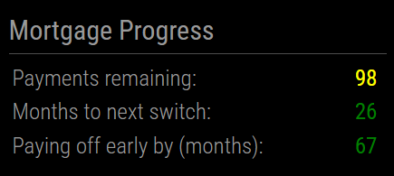

# MMM-MortgageCountdown

A [MagicMirror²](https://github.com/MagicMirrorOrg/MagicMirror) module that tracks the number of mortgage payments you have left, months to next switch and tells you if you are ahead or behind on your eta for paying it all off.



## Installation

Clone this module into your MagicMirror² modules folder:

```bash
cd ~/MagicMirror/modules
git clone https://github.com/TouaregWarrior/MMM-MortgageCountdown
```

## Configuration

There are only 3 fields - hopefully easy to understand!

- `lastPaymentDate`   Your last mortgage payment date
- `nextSwitchDate`    Date of when your deal comes to an end and you want to switch by.
- `originalCompletionDate`   The date you plan on the last payment date. I use this as my original payoff date. I have reguarly switched and taken a year off the full term here and there. This should remain as your original payoff date.

Example config.js entry should look like

```js
  {
       module: "MMM-MortgageCountdown",
       position: "top_right",
       config: {
           lastPaymentDate: "2033-01-01",        // Your last mortgage payment date
           nextSwitchDate: "2027-01-01",         // Set your next switch date
           originalCompletionDate: "2038-08-30", // Original mortgage completion date
       }
  },
```

## Update

Go to the module’s directory and pull the latest version from GitHub:

```bash
cd ~/MagicMirror/modules/MMM-MortgageCountdown
git pull
```
